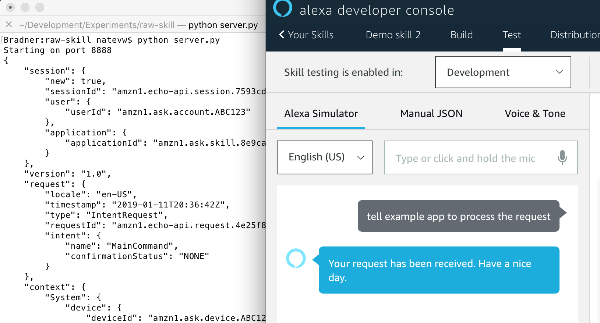

# "Raw" Alexa Skill

I shared some background on [Building Alexa Skills](https://github.com/fullstacktc/meetupnotes/tree/master/2019-01) in early 2019 at a [Full Stack Tri-Cities](https://fullstacktc.org/) meeting. Part of that presentation involved walking through creating a new skill. Ended up mostly focusing on my [Egg Tracker code](https://github.com/natevw/chickening-alexa) instead of this, but wanted to share it anyway as a Python/raw JSON example.



## Usage

The "server.py" file is barebones Python script with no dependencies. When you run it (`python server.py`), it starts an HTTP server listening on port 8888. It responds to pretty much any reasonable POST request with a hardcoded Alexa response.

You can verify that it's working by making a request to it from another shell:

    curl localhost:8888 -d '{}'

And you should see the payload it will pass back as its response to the Alexa service. See the Alexa [Request and Response JSON Reference](https://developer.amazon.com/docs/custom-skills/request-and-response-json-reference.html) documentation for more.

## Hosting it

How do you get the Alexa service to connect to this little server?

One fun trick I didn't really emphasize during my talk was that I had the Alexa web service connecting to very process running *on my laptop* even through the coworking space WiFi! Here's how I did that.

Amazon requires an HTTP**S** endpoint, which I suppose I could have set up on my laptop (I think they even support self-signed certs if you upload the public key) and then opened ports or something, but I already had a [trusted SSL certificate](https://letsencrypt.org/) set up for some subdomains on a [public site](https://ipcalf.com) I host.

### Server config

I added a new block to my [nginx config](http://nginx.org/en/docs/http/ngx_http_proxy_module.html) file for that domain:

```
server {
    server_name .temp.ipcalf.com;
    include includes.d/ipcalf_ssl.conf;
    location / {
        proxy_pass http://localhost:4242;
    }
}
```

After reloading the nginx service, visiting <https://temp.ipcalf.com> "works" but gives a bad gateway error since there's nothing on port 4242 on this server itself. Easily fixed!

### Local commands

From my laptop, I run each of these commands in its own terminal:

```
# first terminal, run the server (listens on port 8888)
python server.py

# second terminal, has ssh tunnel 4242 on the web server to 8888 on laptop
ssh ipcalf.com -R 4242:localhost:8888 -N
```

The `ssh -R` is the key trick, really handy during development! There's another I use even more `ssh -L` to bring a port on my remote server (usually a database or something) onto my local laptop to use via tools there.

I'm sure there's other ways to do this but this one didn't require any other services than I already had running on my webserver and installed on my laptop.


## Sample skill

To hook this up on the Amazon side:

1. Add a new skill via <https://developer.amazon.com/alexa/console/ask>
2. Enter any skill name, I used "Demo Skill". Leave the "Custom" skill model selected. Click "Create Skill" button (top right).
3. On the "Choose a template" step, leave "Start from scratch" selected. Click "Choose" button (top right).
4. You should now be in their skill editing UI. Go to the "Endpoint" option (near bottom of sidebar) and choose where your API is hosted. For my skill I used an HTTPS endpoint, putting <https://temp.ipcalf.com> in for the Default Region value. Click the "Save Endpoints" button (top near sidebar).
5. Click the "Invocation" and make sure it says what you want, e.g. "example app".
6. Add an Intent, the name doesn't matter for now since our little server doesn't pay attention, e.g. `MainCommand`.
7. Add some sample utterances to this intent, like "process the request" (press the + plus button for each)
8. Click the "Build Model" button (center above) and wait until you get a new popup notification for "Build Successful"
9. Now go to the Test tab (top toolbar) and choose "Development" where it says "Test is disabled for this skill"
10. Type (or hold the mic icon and say): "tell *example app* to *process the request*" using your invocation and utterance.
